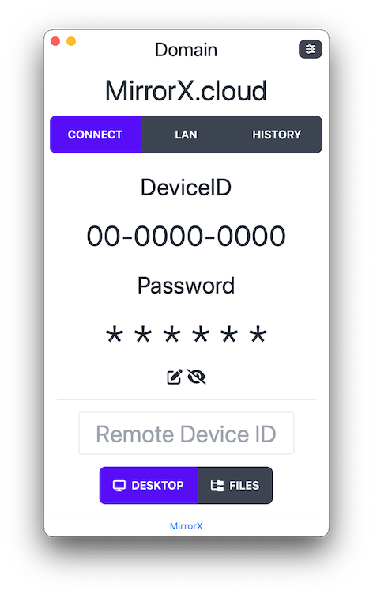

# 
 MirrorX

## MirrorX is a remote desktop control tool powered by Rust and Flutter. With fully opensource client and server, native E2EE support, users can build SECURITY and FAST remote control network, which is fully under control of users.

> **MirrorX is on the early stage with active developing now. Please forgive us that we cannot make any backward compatibility commitments at this time.**

## Component
* [MirrorX Client]()
* [MirrorX Signaling Server]()
* [MirrorX Endpoints Server]()

## Available Platform
- [x] macOS
- [x] Windows
- [ ] Linux
- [ ] Android
- [ ] iOS

## Hot to build
> todo